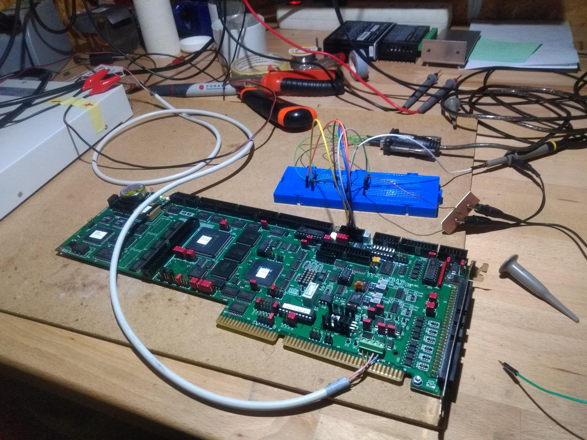

Recently, a friend of mine aquired quite a massive industrial dispenser machine (or something similar, I am not 100% sure what it even did exactly). This machine was given to him for free, or, for the expense of bringing to his workshop, so to say, which is not so negligible.

It is my friend's and my plan to convert this machine in a CNC-machine for light-duty machining (aluminum and such). However, we do not want to spend too much
money on the project, because it is quite old and also not the ideal CNC-machine in some ways. So it would be nice to be able to reuse the old control system of the machine. The heart is an ISA-Card specifically designed for this purpose, the so-called "Universal PMAC-lite".

Luckily, the documentation is still available. This card is able to do all sorts of complex motion operations such as jerk limitation, max-acceleration-limiting with look-ahead-feature, transformations between different coordinate systems, etc. etc. on 8 axis synchronously. So is quite a beast and certainly overkill for what we would like to do it.

(To be continued)

<!-- more -->
